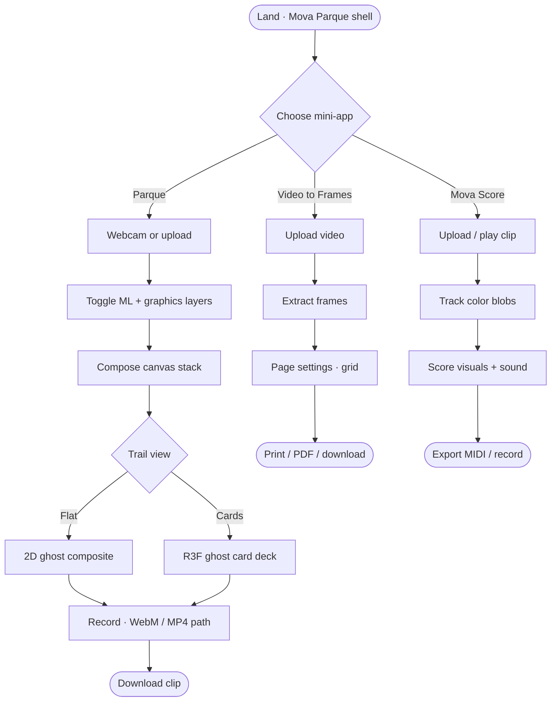
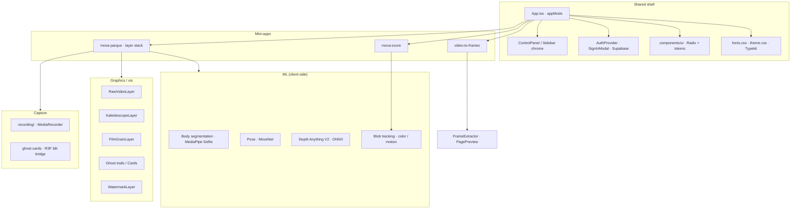
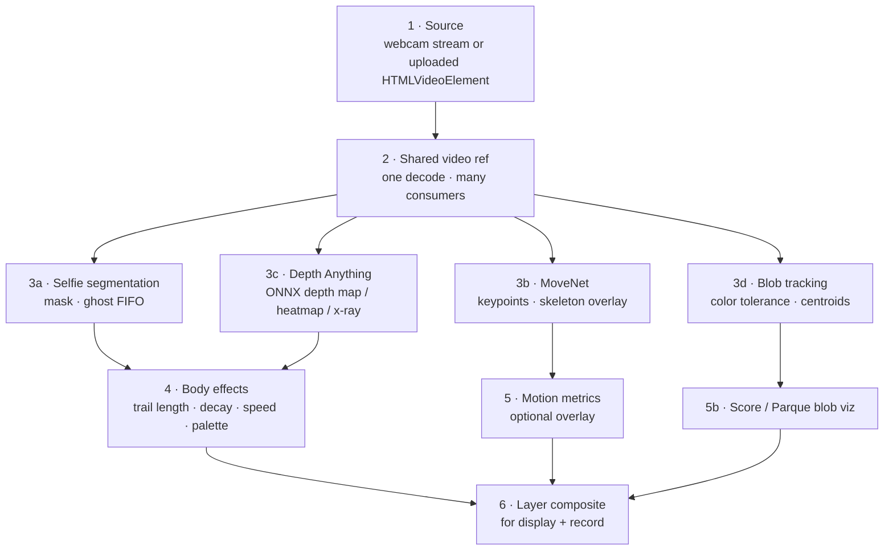
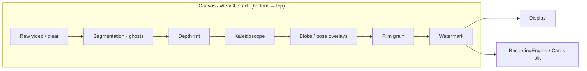
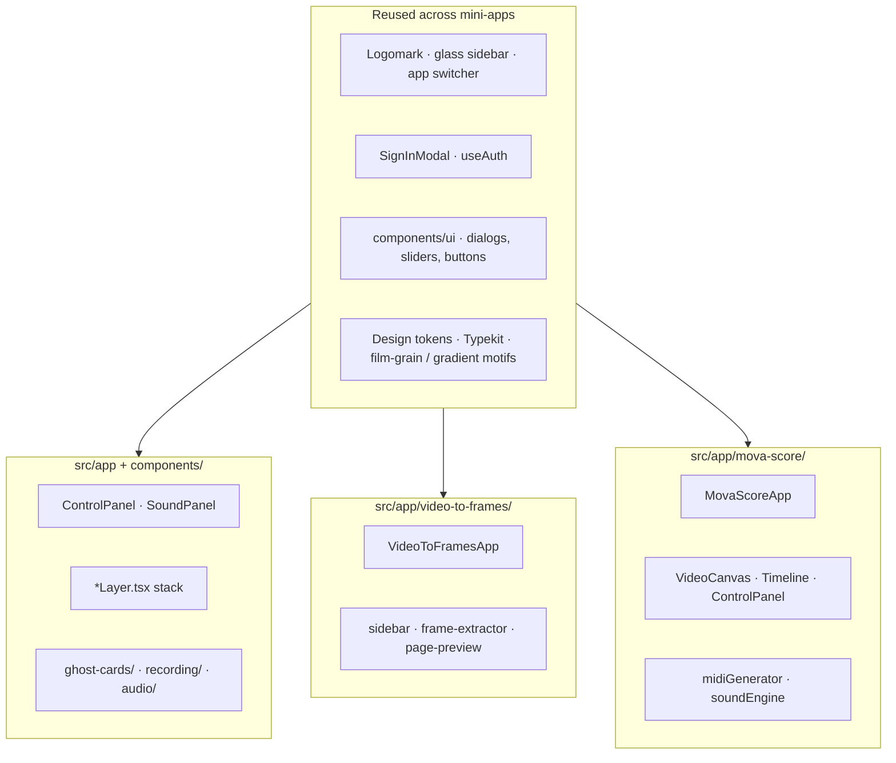
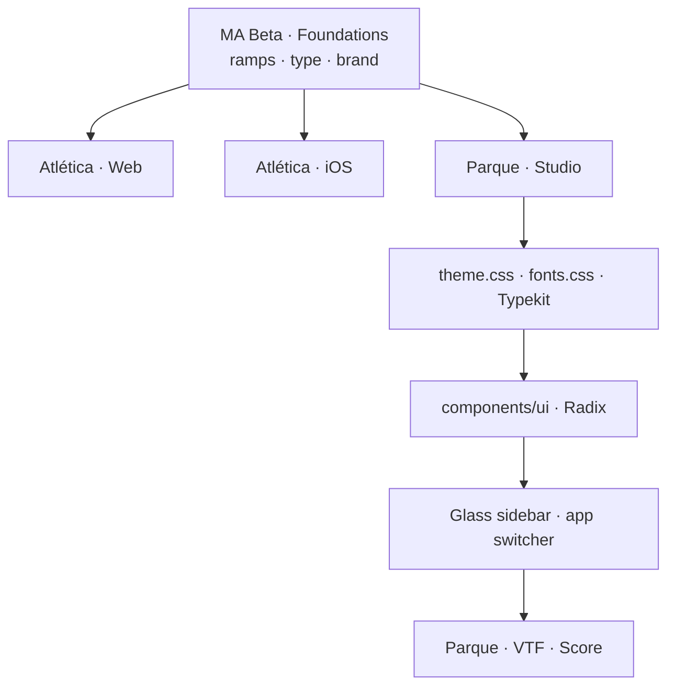
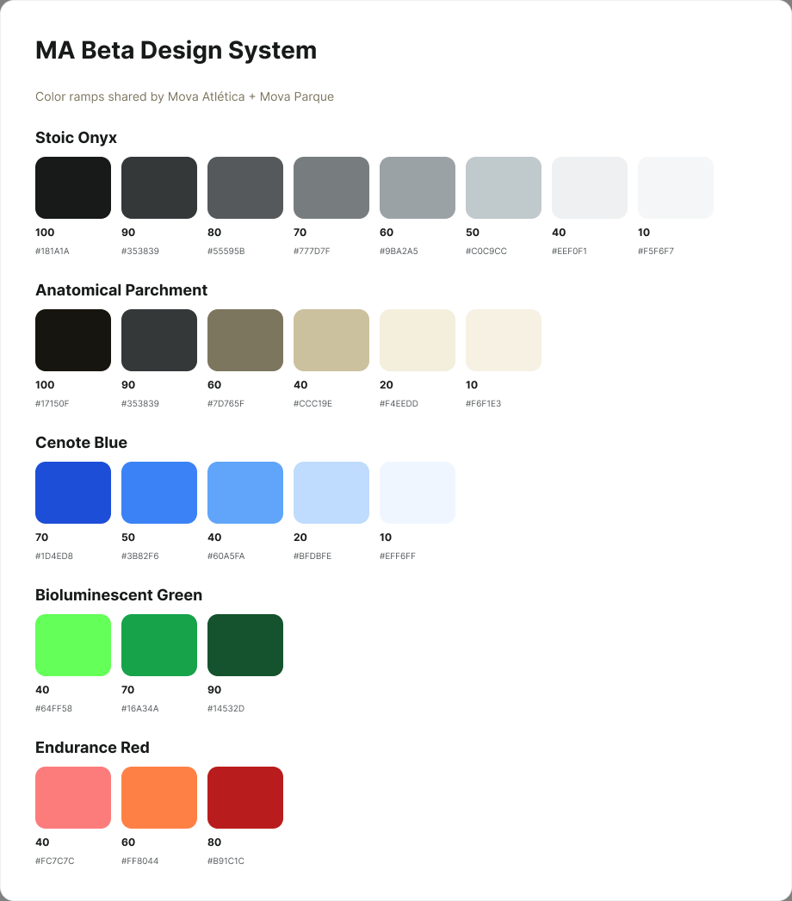

# Mova Parque

**Creative motion lab for Mova Atlética** — live camera and uploaded video become layered visuals, depth, pose overlays, sound, and exportable clips across three mini-apps in one shell.

> **Sister product (trainers & athletes):**  
> **[Mova Atlética](https://www.mova-atletica.xyz/)** · [app.mova-atletica.xyz](https://app.mova-atletica.xyz) · [portfolio case study](https://www.treybradley.xyz/mova-atletica)  
>
> **Design foundations:** [MA Beta Design System](https://www.figma.com/design/If7L5q9fnsivf9mkaiFH4n/MA-Beta-Design-System) · product page: [Parque · Studio](https://www.figma.com/design/If7L5q9fnsivf9mkaiFH4n/MA-Beta-Design-System?node-id=6262-2)

_One brand system, many product surfaces._ MA Beta holds shared foundations (color, type, brand). **Mova Parque** is the creative / R&D surface next to Atlética web (`mova-mvp-dev-01`) and iOS — same concepts, implementation-led chrome (glass studio shell), different job (play, compose, export vs sport coaching).

---

## What ships today

| Surface | What it does |
|--------|----------------|
| **Mova Parque** | Real-time visual system: body segmentation ghosts, kaleidoscope, film grain, blob tracking, MoveNet pose, Depth Anything, Tone.js sound, record/export (flat trails or 3D **Cards**) |
| **Video to Frames** | Upload → extract frames → print-ready contact sheets (grid, margins, registration marks, PDF/print) |
| **Mova Score** | Color-blob tracking → visual score overlays → live synth + MIDI export |

One Vite/React app; mode switch in the shared sidebar keeps chrome, logomark, and auth consistent across mini-apps.

---

## User flow



---

## System architecture



**Stack (high level)**

| Layer | Technology |
|-------|------------|
| App shell | Vite 6, React 18, TypeScript |
| Styling | Tailwind CSS 4, CSS variables, Adobe Fonts (Typekit `ldv0cwj`) |
| UI primitives | Radix UI + shadcn-style `components/ui` |
| 3D / Cards | Three.js, React Three Fiber, Drei |
| Pose / body | TensorFlow.js, `@tensorflow-models/pose-detection` (MoveNet), `@tensorflow-models/body-segmentation` (MediaPipe Selfie) |
| Depth | ONNX Runtime Web · Depth Anything V2 Small |
| Audio | Tone.js (`AudioEngine`) · Mova Score synth + MIDI |
| Auth / backend | Supabase JS (session-aligned with Atlética product patterns) |
| Export | Canvas composite + `MediaRecorder` (`recording/`) |

---

## ML pipeline



| Stage | Where it lives |
|-------|----------------|
| Segmentation + ghosts | `BodySegmentationLayer` · `ghost-cards/ghostFrameBridge` |
| Pose | `PoseEstimationLayer` · `utils/poseTracking` · `utils/drawPoseOverlay` |
| Depth | `DepthLayer` · `depth-anything/utils` |
| Blobs | `BlobTrackingLayer` · `utils/blobTracking` · Mova Score `utils/blobDetection` |
| Motion stats | `MotionAnalysisOverlay` · `utils/motionMetrics` |

**Principles (shared with Atlética)**

- **On-device first** — models run in the browser; no server round-trip for live FX.
- **Toggle honesty** — disabled layers drop out of the composite and the recorder.
- **Creative, not clinical** — Parque explores look and feel; sport coaching and Insights live in the sister product.

---

## Graphics / visualization pipeline



| Concern | Implementation |
|---------|----------------|
| Blend / haze / mood | Atmosphere + palette controls in `App` → layers |
| Kaleidoscope | `KaleidoscopeLayer` · horizontal / vertical / radial |
| Flat vs Cards | `trailView`: flat composites in 2D; Cards lazy-loads `GhostCardDeck` (R3F + reflector floor + timeline ticks) |
| Cards export | `cardsRecordBridge` blits WebGL → 2D at source aspect |
| Sound | `SoundPanel` + `AudioEngine` (Tone) driven by mood / movement |

---

## Mini-app structure



```
src/app/
├── App.tsx                 # mode router + Parque state
├── components/             # Parque layers + shared modals
│   ├── ui/                 # design-system primitives (Radix)
│   ├── ControlPanel.tsx    # shell + Parque controls
│   └── *Layer.tsx          # ML / graphics stack
├── ghost-cards/            # 3D trail view + record bridge
├── recording/              # MediaRecorder pipeline
├── audio/                  # Tone.js engine
├── depth-anything/         # ONNX depth helpers
├── auth/ · supabase/       # session
├── video-to-frames/        # mini-app
└── mova-score/             # mini-app
src/styles/                 # fonts · theme · Tailwind
src/utils/                  # pose, blobs, motion, color theory
```

Mini-apps keep **feature** components local (`mova-score/components`, `video-to-frames/components`) but share **shell language**: glass panels, uppercase micro-labels, Logomark, mode dropdown, auth modal, and the same tokenized UI kit — the same cohesion pattern as Atlética’s `LibraryShell` / account surfaces, tuned for a dark creative studio.

---

## Design system — foundations → product pages

**[MA Beta](https://www.figma.com/design/If7L5q9fnsivf9mkaiFH4n/MA-Beta-Design-System)** defines shared foundations (ramps, type, brand). Each shipped product is a **page / surface** that interprets those concepts — not a 1:1 sync of every Figma component into code.

| Figma / product page | Surface | What it interprets |
|----------------------|---------|--------------------|
| **Foundations** (MA Beta library) | Tokens & brand | Stoic Onyx, Parchment, Cenote, type |
| **Atlética · Web** | `mova-mvp-dev-01` | Sport tools, Account, Motion Studio |
| **Atlética · iOS** | Native app | Same concepts · Vision / ARKit |
| **Parque · Studio** | This repo | Creative lab · glass chrome · three mini-apps |

Live Parque UI is **implementation-led** (Radix / shadcn defaults + glass twist). Figma documents the shared vocabulary and as-built patterns; it does not claim unused legacy component sets match production.



### Color ramps (foundations)

Library styles: **Stoic Onyx**, **Anatomical Parchment**, **Cenote Blue**, **Bioluminescent Green**, **Endurance Red**.

<p align="center">
  
</p>

| Ramp / token role | Key hex | Use in Parque |
|-------------------|---------|----------------|
| Stoic Onyx / `--background` | `#181a1a` | Stage void, Cards clear `#07080c` family |
| Stoic Onyx / foreground | `#F3F3F4` · `#c0c9cc` | Primary & secondary labels |
| Anatomical Parchment / `--card-bg` | `#f6f1e3` | Light surfaces, print previews |
| Anatomical Parchment muted | `#7d765f` | Secondary copy |
| Cenote Blue / `--accent` | `#3b82f6` | Product CTAs; glass chrome often uses white/alpha instead |
| Bioluminescent Green / `--success` | `#64FF58` | Armed / positive states |
| Endurance Red / `--error` · warning | `#FC7C7C` · `#ff8044` | Errors · caution |

### Parque · Studio — as-built patterns

Creative extension of Stoic Onyx, reverse-documented from live code on the Figma **[Parque · Studio](https://www.figma.com/design/If7L5q9fnsivf9mkaiFH4n/MA-Beta-Design-System?node-id=6262-2)** page (*code → Figma*, ready for bidirectional iteration):

| Figma component | Live source | Variants |
|-----------------|-------------|----------|
| **Parque / GlassButton** | Webcam / primary actions | Default · Hover · Active · Disabled |
| **Parque / IconButton** | Header ⋮ / close | Default · Hover |
| **Parque / SegmentedControl** | Trail View flat/cards | Selected=flat · cards |
| **Parque / MegaMenu** | Apps & Account dropdown | Closed · Open |
| **Parque / StagingArea** | Upload or record video | Empty · Upload · Webcam |
| **Parque / SectionAccordion** | `CollapsibleSection` | Closed · Open |
| **Parque / StudioSiderail** | Control panel shell | Desktop 400 · Mobile 320 |

| Pattern | Values |
|---------|--------|
| Panel | `bg-black/40` · `backdrop-blur-xl` · `border-white/10` |
| Label | `text-white/60` · `uppercase` · `tracking-wider` · `text-[11px]` |
| Control | `bg-white/5` · hover `bg-white/10` · active `bg-white/15` |

```
Glass sidebar
├── Header — title · MegaMenu · close
├── StagingArea — upload dropzone / webcam
├── SectionAccordion stack — Body Trails · Motion & Depth · …
└── Footer — Record & Export
```

### Typography

| Family | Source | Use |
|--------|--------|-----|
| **roboto-mono** | Adobe Fonts kit `ldv0cwj` | Metrics, timecodes, Cards floor ticks (`font-mono`) |
| **joost** | Same Typekit kit | Display / sans option (`--font-sans`) |
| **Roboto / Roboto Mono** | Atlética · MA Beta foundations | Product parity / portfolio |

| Area | Location |
|------|----------|
| Shell / Parque controls | `src/app/components/ControlPanel.tsx` |
| UI kit | `src/app/components/ui/` |
| Tokens / type | `src/styles/theme.css`, `fonts.css`, `index.html` Typekit link |
| Design docs (exports) | `docs/design-system/` |
| VTF / Score chrome | `*/components/sidebar.tsx`, `animated-gradient`, `film-grain`, `grid-pattern` |

Figma: **[MA Beta](https://www.figma.com/design/If7L5q9fnsivf9mkaiFH4n/MA-Beta-Design-System)** · **[Parque · Studio](https://www.figma.com/design/If7L5q9fnsivf9mkaiFH4n/MA-Beta-Design-System?node-id=6262-2)** · portfolio: **[treybradley.xyz/mova-atletica](https://www.treybradley.xyz/mova-atletica)**.

---

## Running the code

```bash
npm i
npm run dev
```

Build:

```bash
npm run build
```

Copy `.env.example` → `.env` and set Supabase (and any other) keys as needed for auth.

---

## License

See repository license / [`ATTRIBUTIONS.md`](./ATTRIBUTIONS.md) for third-party notices (including shadcn/ui).

## Support

Product and case-study context: **[treybradley.xyz/mova-atletica](https://www.treybradley.xyz/mova-atletica)**.  
Mova Atlética: [mova-atletica.xyz](https://www.mova-atletica.xyz/) · support@mova-atletica.xyz
